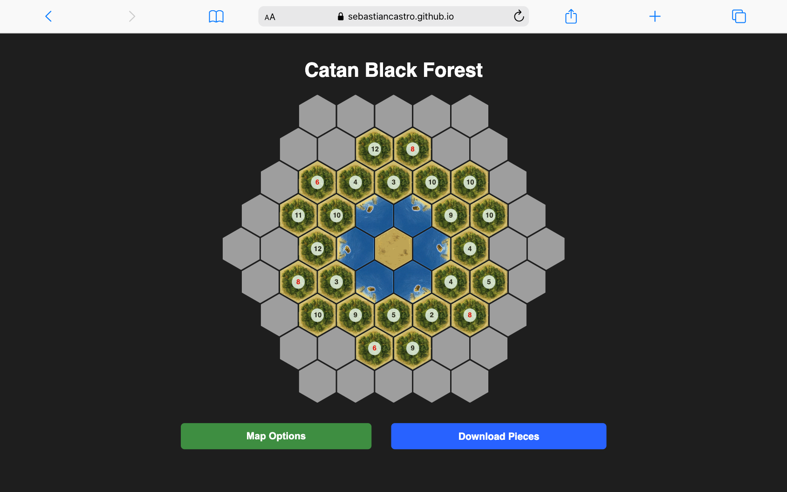

# Catan Black Forest Generator

A web-based tool for generating custom Settlers of Catan maps with a Black Forest theme, featuring fixed forest tiles and randomized terrain distribution for other areas.

## Features

* Generates a hexagonal game board with 61 tiles

* Fixed forest terrain tiles that remain constant

* Customizable desert and port locations

* Configurable port rotations (0-360 degrees)

* Randomized distribution of other terrain types (brick, wool, wheat, ore)

* Control over number distributions (including red numbers 6 and 8)

* Fog of war mechanic - tiles start hidden and are revealed when clicked

* Printable game pieces download option

## How to Use

1. Open `https://sebastiancastro.github.io/catan-black-forest/` in your web browser

2. Customize the map settings:

   * Specify which tiles should be forest

   * Set desert tile locations

   * Configure port locations and rotations

   * Adjust terrain distribution counts

   * Control number distributions (especially 6s and 8s)

3. Click "Generate Map" to create your custom board

4. Click on gray tiles to reveal their hidden terrain and numbers

5. Use "Download Printable Game Pieces" to get PDF resources

## Customization Options

### Forest Tiles

Enter the tile numbers that should be forest terrain. These tiles will remain fixed as forest regardless of randomization.

### Desert Tiles

Enter the tile numbers that should be desert terrain. Desert tiles don't produce resources.

### Port Tiles

Enter the tile numbers for port locations. Ports allow for more favorable trading ratios.

### Port Tile Rotations

Define the rotation of each port in degrees (0-360) using JSON format (e.g., `{"22": 180, "23": 240}`).

### Fog Terrain Distribution

Set how many of each terrain type should appear in the "fog" (unexplored) areas of the map.

### Number Distributions

Control how many "red" numbers (6 and 8) appear on the map.

## Technical Details

* Pure HTML, CSS, and JavaScript (no dependencies)

* Responsive design that works on desktop and mobile

* Hexagonal grid generated dynamically

* Randomization algorithms ensure balanced distribution

## License

This project is open source and available for anyone to use or modify.

## Credits

Created by Sebastian Castro. Inspired by colonist.io